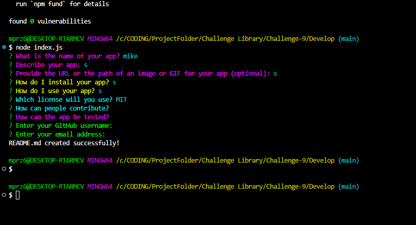

# Read me generator

## Table of Contents
- [Description](#description)
- [Installation](#installation)
- [Usage](#usage)
- [License](#license)
- [Contributing](#contributing)
- [Questions](#questions)

## Description
this app is designed to create a readme out of a prompt of questions

## Installation
by entering into the terminal of the parent folder and typing npm i and node index.js

## Usage
after running the app you have to fill out a prompt of questions, afterwards the readme is made for you.

## License
This project is licensed under the [Apache 2.0](https://opensource.org/licenses/Apache-2.0) license.

## Contributing
Na

## Tests
Na

## Questions
For any questions, you can reach me at:
- GitHub: [MIKEYP53](https://github.com/MIKEYP53)
- Email: mprz646@gmail.com
